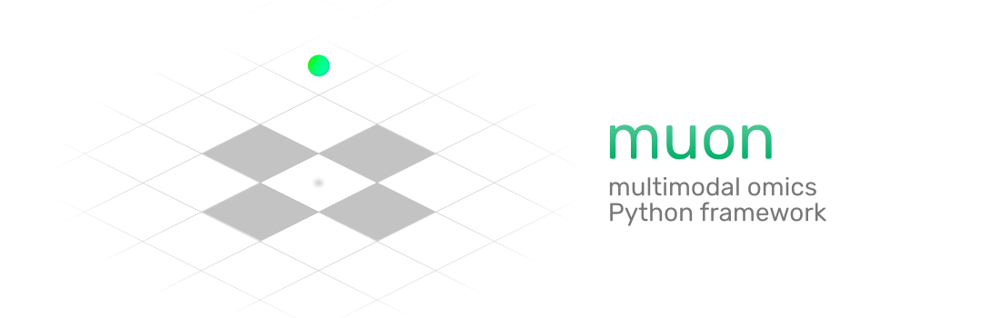

> Please note the project is experimental and no stable API is being provided as this point.



`muon` is a multimodal omics Python framework.

## Data structure

In the same vein as [scanpy](https://github.com/theislab/scanpy) and [AnnData](https://github.com/theislab/anndata) are designed to work with scRNA-seq data in Python, `muon` is designed to provide functionality to load, process, and store multimodal omics data.


```
muon
  .obs     -- annotation of observations (cells, samples)
  .var     -- annotation of features (genes, genomic loci, etc.)
  .obsm    -- multidimensional cell annotation, 
              incl. indices list for each modality
              that links .obs to the cells of that modality
  .varm    -- multidimensional feature annotation, 
              incl. indices list for each modality
              that links .var to the features of that modality
  .mod
    AnnData
      .X    -- data matrix (cells x features)
      .var  -- annotation of features (genes, genomics sites or windows)
      .obs  -- cells metadata (assay-specific)
      .uns
  .uns
```

By design, `muon` can incorporate disjoint multimodal experiments, i.e. the ones with different cells having different modalities measured. No redundant empty measurements are stored due to the distinct feature sets per assay as well as distinct cell sets mapped to a global set of observations.

### Input

For reading multimodal omics data, `muon` relies on the functionality available in scanpy. `muon` comes with `MuData` — a multimodal container, in which every modality is an AnnData object:

```py
from muon import MuData

mdata = MuData({'rna': adata_rna, 'atac': adata_atac})
```

If multimodal data from 10X Genomics is to be read, `muon` provides a reader that returns a `MuData` object with AnnData objects inside, each corresponding to its own modality:

```py
import muon as mu

mu.read_10x_h5("filtered_feature_bc_matrix.h5")
# MuData object with n_obs × n_vars = 10000 × 80000 
# 2 modalities
#   rna:	10000 x 30000
#     var:	'gene_ids', 'feature_types', 'genome', 'interval'
#   atac:	10000 x 50000
#     var:	'gene_ids', 'feature_types', 'genome', 'interval'
#     uns:	'atac', 'files'
```

### I/O with `.h5mu` files

`muon` operates on multimodal data (MuData) that represents modalities as collections of AnnData objects. These collections can be saved to disk and retrieved using HDF5-based `.h5mu` files, which design is based on `.h5ad` file structure.

```py
mdata.write("pbmc_10k.h5mu")
mdata = mu.read("pbmc_10k.h5mu")
```

It allows to effectively use the hierarchical nature of HDF5 files and to read/write AnnData object directly from/to `.h5mu` files:

```py
adata = mu.read("pbmc10k_10k.h5mu/rna")
adata.write("pbmc_10k.h5mu/rna")
```

## Multimodal omics analysis

`muon` incorporates a set of methods for multimodal omics analysis. These methods address the challenge of taking multimodal data as their input. For instance, while for a unimodal analysis one would use principal components analysis, `muon` comes with a method to run [multi-omics factor analysis](https://github.com/bioFAM/MOFA2):

```py
# Unimodal
import scanpy as sc
sc.tl.pca(adata)

# Multimodal
import muon as mu
mu.tl.mofa(mdata)
``` 

## Individual assays

Individual assays are stored as AnnData object, which enables the use of all the default `scanpy` functionality per assay:

```py
import scanpy as sc

sc.tl.umap(mdata.mod["rna"])
```

Typically, a modality inside a container can be referred to with a variable to make the code more concise:

```py
rna = mdata.mod["rna"]
sc.pl.umap(rna)
```

### Modules in `muon`

Currently muon comes with a set of modules that can be used hand in hand with scanpy's API. These modules are named after respective sequencing protocols and comprise special functions that might come in handy. It is also handy to import them as two letter abbreviations:

```py
from muon import atac as ac
#                        ^
#                        |
#      ATAC module: e.g. ac.pp.tfidf()

from muon import protein as pt
#                           ^
#                           |
#                 protein (epitope) module
```

While sticking to the same API on their surface, the functions from these modules can be different in their implementation:

- Some provide new methods, e.g. `ac.tl.lsi()` for Latent Semantic Indexing. 

- Others mimic scanpy's API essentially using them under the hood but provide additional functionality, e.g. `ac.pl.umap()` allows to use gene names for plotting aggregated peak counts. 

- There's also a mix of both like `ac.tl.rank_peaks_groups()` that uses `sc.tl.rank_genes_groups()` and also calls `ac.tl.add_genes_peaks_groups()`.

There are some rules that functions in those modules try to follow:

1. Stay close to AnnData/MuData-centered worflow as much as possible. The default exprectation is to have it as the first argument of a function, and the function modifies the object in place by default.

1. Accept both AnnData and MuData with default keys for modalities such as `'rna'`, `'atac'`, and `'prot'`.

1. Small code overhead. If there's analogous functionality in AnnData or in scanpy, build on top of it. This is important both for matching users' expectations and for reducing the cost of supporting the code across its different versions.

1. Existing plotting functions should be reused unless specific plots are required for certain modalities.

